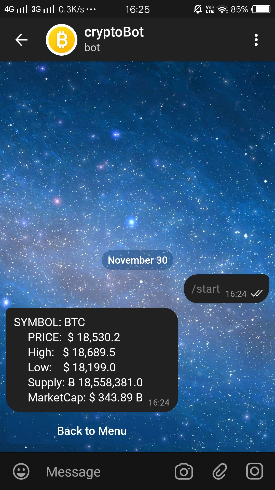

# Crypto-Bot 
- crypto Telegram bot using Node.js



### What is it??
- This Bot is Created to Track the Prices of Crypto currencies

### How to Run 

- To clone Repository:
```bash
$ git clone [Repo URL]
```

- To install Dependencies:
```bash
$ npm install
```
- To Run:
```bash
$ npm start
```

## Status

NEXT PROJECT ==> In Progress 👨‍💻

# Telegram Crypto-Bot 🤖# crypto-BOT
